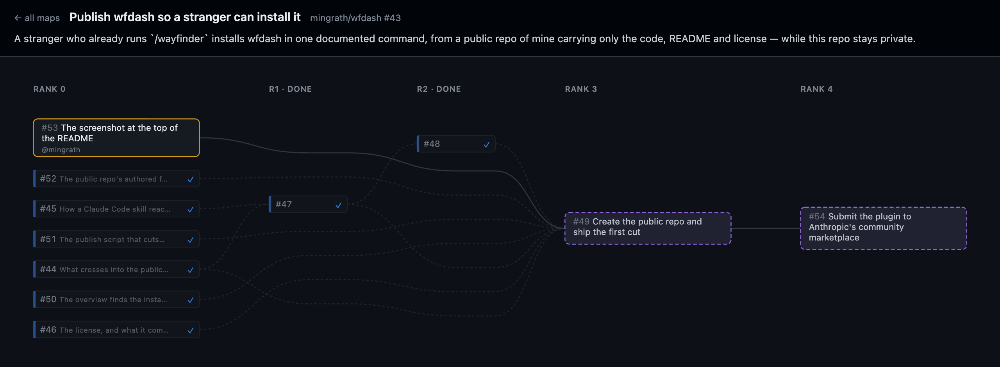

# wfdash

A wayfinder map is a GitHub issue whose sub-issues are its tickets, wired together with
native issue dependencies. GitHub renders that as a flat list, so the shape of an effort —
what is finished, what is takeable right now, what is waiting on what — is not visible
anywhere. `wfdash` serves it as a local browser dashboard: one map drawn as a dependency
DAG, plus an overview of every map you can see, across every repo.

Read-only, zero npm dependencies, no build step.

## Install

    npm i -g @mingrath/wfdash
    wfdash install

The first line gives you the `wfdash` command. The second copies the skill into every agent
on your machine that reads one, and tells you what it wrote and what it skipped:

    wfdash 0.1.1 — installed into 2 of 3 targets

      wrote     ~/.agents/skills/wfdash/SKILL.md  Codex CLI, Cursor, Gemini CLI and 2 more
      skipped   ~/.claude/skills/                 Claude Code — the wayfinder-tools plugin is already installed
      wrote     ~/.kiro/skills/wfdash/SKILL.md    Kiro

      not on this machine: Continue.dev, Windsurf, Qwen Code, JetBrains Junie, Trae, Kilo Code

It writes at the user level only, one file per agent — `SKILL.md` and nothing else — and it
never overwrites a `wfdash` skill it did not write. Run it again after upgrading; a second
run is safe and reports `unchanged`. `--agent <name>` installs into one agent whether or not
it is on this machine, and `--all` lists the ones that are not.

**Claude Code users can skip npm entirely** and take the plugin instead:

    /plugin marketplace add mingrath/wfdash
    /plugin install wayfinder-tools@mingrath
    /reload-plugins

Both channels are cut from the same tree at the same version. If you have both, `wfdash
install` leaves Claude Code alone and says so — the plugin already carries the skill.

## Requires

- **`gh` on `PATH` and authenticated** — `gh auth login`. wfdash shells out to it from the
  server, so it inherits your existing auth and no token ever reaches the browser.
- **Node 18 or newer** — ES modules and a built-in `fetch`. Nothing else; there are no
  dependencies to install.
- **An agent that loads a `SKILL.md`**, or none at all — `wfdash` is a normal command and
  works on its own from a terminal.
- **Maps to look at.** wfdash reads one convention: an issue labelled `wayfinder:map`, its
  tickets as GitHub sub-issues, blocking as native issue dependencies. It is built for maps
  charted by the `/wayfinder` skill.

## Use

    wfdash                      # the overview
    wfdash owner/repo#12        # one map
    wfdash stop
    wfdash restart

A target may be written `owner/repo#N`, `owner/repo/N`, or as a GitHub issue URL. The
command prints a URL and opens a browser at it. Ask your agent "what's takeable?" and it
will do this for you.

**Where there is no browser** — a container, a cloud task, a background agent — nothing is
opened and it says so, because a silent failure here looks exactly like success:

    http://127.0.0.1:7777/m/owner/repo/12
    wfdash: no browser here (no DISPLAY or WAYLAND_DISPLAY) — nothing was opened, the URL above is yours to open.

The dashboard is running either way. `WFDASH_NO_BROWSER=1` forces it.

## What you get

- **The overview** — every map you can see, as cards sorted takeable-first. Each says in a
  word whether there is anything to take: `3 takeable`, `none takeable`, `✓ all 9 resolved`.
- **The map view** — one map as a layered DAG, rank as a column, left to right. Click a
  ticket for its question, its blockers by name, and its whole comment thread.

Both pages poll, so claiming a ticket in your terminal shows up without a reload.

## Which agents this works in

**Verified by hand, on a real machine, by watching the dashboard open:**

| Agent | Reads |
| --- | --- |
| **Codex CLI** | `~/.agents/skills/` |
| **Cursor** | `~/.agents/skills/` |

**Untested — the install path is confirmed from each vendor's own documentation, but nobody
has run wfdash there.** That is a weaker claim than the two above, and it is not a prediction
of failure:

| Reads `~/.agents/skills/` | Reads a vendor path |
| --- | --- |
| Gemini CLI, GitHub Copilot, Amp, Goose, OpenHands, opencode, Charm Crush, Zed, Warp, Cline, Augment Code, OpenClaw, Factory Droid | Claude Code `~/.claude/skills/` · Continue.dev `~/.continue/skills/` · Windsurf `~/.codeium/windsurf/skills/` · Qwen Code `~/.qwen/skills/` · Kiro `~/.kiro/skills/` · JetBrains Junie `~/.junie/skills/` · Trae `~/.trae/skills/` · Kilo Code `~/.kilo/skills/` |

Sixteen of the twenty-four read `~/.agents/skills/`, so most of the table is one directory
rather than twenty-four. Devin is the exception that cannot be reached: it loads skills from
a repository only, with no user-level path at all.

If wfdash does not appear in your agent, check its own skills list first — an agent that
fails to start looks identical, from the outside, to a skill that failed to load. If the path
in this table is wrong or has moved, that is a bug report worth filing.

## Finding your maps

The overview searches GitHub for open issues labelled `wayfinder:map` owned by whoever `gh`
is logged in as. Maps in an organisation's repos, or in repos you only collaborate on, are
not found by that search — set `WFDASH_SEARCH` to a query that reaches them:

    WFDASH_SEARCH='label:"wayfinder:map" state:open org:acme'

A search that quietly returns a subset is the one failure this cannot detect for itself, so
a short overview is worth a second look rather than a shrug.

## What it will not do

- It never writes to your tracker. There are zero write endpoints.
- It shells out to `gh` from the server, so it inherits your existing auth and no token
  ever reaches the browser.
- It serves on `127.0.0.1:7777` and nowhere else. `WFDASH_PORT` moves it. It holds no auth,
  so reaching it from another machine is your port-forward to arrange, not a feature here.
- It reaps itself after 30 idle minutes.

## Updating

    npm i -g @mingrath/wfdash@latest
    wfdash install

If the command notices your installed skill is a different version from itself, it says so
in one line and carries on. Third-party Claude Code marketplaces do not auto-update either:

    /plugin marketplace update mingrath

## Contributing

Bug reports are welcome as issues. Pull requests are welcome too, but this repo is published
from another one as a squashed commit per release, so a PR cannot be merged directly — an
accepted patch is applied upstream and lands in the next release with you credited in the
commit.

## License

MIT.
